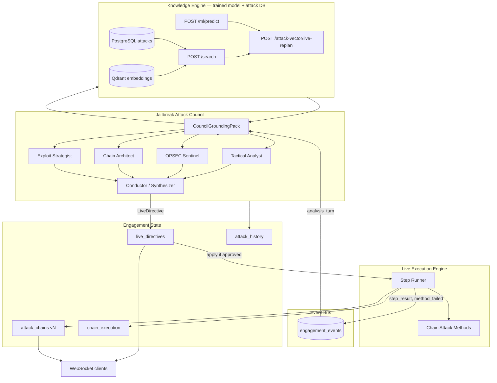
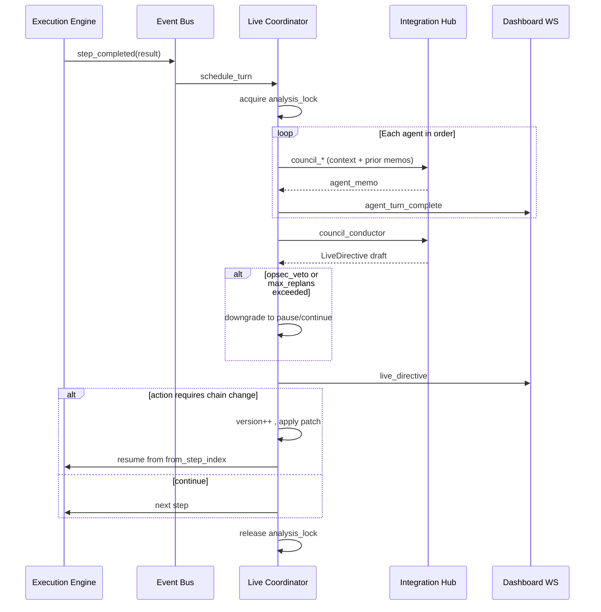

# Live Multi-Agent Jailbreak Attack Council

**Status:** Design (implementation-ready)  
**Scope:** Real-time analysis of attack sequences with live chain reinitiation based on execution results  
**Builds on:** Orchestrator `execute-chain`, `analysis_overseer`, Integration Hub `jailbreak_ai`, chain-attack isolated retries

---

## 1. Problem

Today the platform:

1. Builds attack chains **before** execution (Knowledge Engine + overseer deepening).
2. Runs chains **linearly** with per-step Jailbreak guidance and isolated retries on failure.
3. Updates `analysis_overseer` mainly during **pre-execution** pipeline stages—not continuously during live attack.

There is no **closed loop** where multiple Jailbreak AI specialists observe each step outcome and **rewrite the remaining attack sequence** while execution is in progress.

---

## 2. Goal

A **Live Attack Council (LAC)** runs alongside chain execution:

- **Multiple Jailbreak AI agents** analyze the attack sequence **in turn** after each meaningful event (step complete, method fail, scan delta, exfil signal).
- A **Conductor** merges agent outputs into a single **Live Directive**.
- The **Execution Engine** can **pause**, **patch**, or **reinitiate** the active chain from the current MITRE position using updated objectives.
- All state is **versioned**, **auditable**, and streamed to the dashboard via WebSocket.
- **Every analysis turn is grounded** in the same **trained ML model** and **Attack Dataset** (~14k records: Postgres + Qdrant semantic search) used at engagement start—not free-form Jailbreak improvisation alone.

---

## 2.1 Knowledge grounding (trained model + attack database)

Result-analysing agents do **not** reason in a vacuum. Before any council agent runs, the orchestrator builds one **`CouncilGroundingPack`** per turn by calling the Knowledge Engine—the same stack that powers `runEngagementPipeline` chain generation.

### Data sources (existing)

| Source | API / module | Role in live analysis |
|--------|----------------|------------------------|
| **Attack database** | `AttackSearcher.semantic_search` → `POST /search` | Top-K `AttackRecord` rows similar to failure output + target context |
| **Keyword fallback** | `GET /search/keyword` | When embeddings/Qdrant unavailable |
| **Trained classifier** | `MLModelService.batch_predict` → `POST /ml/predict` | Category + confidence on step/failure text (same 60/40 blend as `AttackChainer`) |
| **Chain builder** | `AttackChainer.build_chains` → `POST /attack-vector` | Full replanned chains from enriched target description |
| **MITRE lookup** | `GET /mitre/{technique_id}` | Technique-specific records for architect agent |
| **Scan analysis** | `POST /ai/analyse/scan` | Fingerprint → vulnerability patterns tagged `trained_model` |

Implementation references:

- `backend/knowledge_engine/search/attack_chainer.py` — semantic search + ML re-rank + phase classification
- `backend/knowledge_engine/search/ingestor.py` — `Attack_Dataset.csv` → Postgres + Qdrant
- `backend/knowledge_engine/ml/ml_service.py` — loaded models from `train_models.py`
- `backend/orchestrator/index.js` — pipeline already logs *"trained model and 14,000+ attack dataset"* at vector generation

### `CouncilGroundingPack` (per turn, shared by all agents)

```typescript
interface CouncilGroundingPack {
  turn: number;
  built_at: string;
  query_text: string;              // derived from last step output + target + services
  dataset_hits: AttackRecordHit[]; // top_k from /search, with scores + record ids
  ml_predictions: MLPrediction[];  // from /ml/predict on failure/success text
  similar_chains_hint?: object;      // optional: patterns from prior successful steps
  replan_candidates?: AttackChain[]; // from /attack-vector/live-replan (conductor only)
  model_metadata: {
    embedding_model: string;
    ml_model_name: string;           // e.g. category classifier id
    dataset_version?: string;
  };
}
```

### Query construction (live results → database lookup)

After each `step_completed` or `method_failed`:

```
query_text = join(
  engagement.target,
  scan_session.fingerprint.services[],
  step.phase,
  step.attack.title,
  step_result.output (last 2k chars),
  failed_method.tool,
  chain_execution.steps[-3:] summaries
)
```

Then:

1. `POST /search` `{ query: query_text, top_k: 15 }`
2. `POST /ml/predict` `{ target_name: "category", text: query_text, top_k: 5 }`
3. If `action` may be `reinitiate_chain`: `POST /attack-vector/live-replan` (see §8.3)

### Agent use of grounding (mandatory citations)

| Agent | Uses grounding for |
|-------|-------------------|
| **Tactical** | Pick next `attack.methods[]` from top dataset hits matching current phase |
| **OPSEC** | `detection_method` / `evasion` fields from cited `AttackRecord`s |
| **Architect** | Fill MITRE gaps using records grouped by `classify_phase()` |
| **Exploit** | Propose tool pivots only if alternate tools appear in dataset hits for same category |
| **Conductor** | Merge memos + call `live-replan`; directive must list `dataset_record_ids[]` |

Jailbreak AI (Integration Hub) receives **`grounding_pack` in every `council_*` request** as structured JSON—not prose summaries—so replans stay tied to real techniques from the CSV corpus.

### Live replan vs initial `attack-vector`

Initial engagement (orchestrator step 5) calls:

```http
POST /attack-vector
{ target_description, detected_services, detected_os, top_chains }
```

Live replan extends the same chainer with **execution feedback**:

```http
POST /attack-vector/live-replan
{
  "target_description": "...",
  "detected_services": [...],
  "detected_os": "...",
  "top_chains": 3,
  "execution_context": {
    "completed_steps": [...],
    "last_failure": { "step", "tool", "output", "method_id" },
    "from_phase": "Execution",
    "from_step_index": 4,
    "prior_directives": ["dir-..."]
  }
}
```

Server-side: append `execution_context` to `full_query` before `semantic_search`, boost records whose `tools_used` / `attack_type` match failed tool, re-run ML re-rank (`0.6 * semantic + 0.4 * ml_confidence`), rebuild chains from phased buckets—**identical logic to `AttackChainer.build_chains`**, new input only.

### Engagement persistence

```json
"live_council": {
  "grounding_history": [
    { "turn": 3, "query_text": "...", "top_hit_ids": ["..."], "ml_top_label": "Web Application Security" }
  ],
  "last_grounding_pack": { ... }
}
```

Dashboard **Council Timeline** shows: *"Turn 3 — 12 dataset hits, ML: Network Security (0.82), replan v4"*

---

## 3. Architecture Overview



---

## 4. Core Concepts

### 4.1 Analysis turn (round-robin council)

An **analysis turn** starts when the event bus emits a trigger (see §6). The orchestrator schedules agents **sequentially** in fixed order (configurable):

| Order | Agent ID | Role | Primary input | Output |
|------:|----------|------|---------------|--------|
| 1 | `tactical` | Immediate next action from last step stdout/artifacts | `last_step_result`, `chain_execution.steps[]` | `tactical_assessment`, `suggested_next_method` |
| 2 | `opsec` | Detection risk, tool noise, pause/abort | boundary profile, OpSec assess snapshot | `risk_delta`, `veto` (bool), `timing_advice` |
| 3 | `architect` | MITRE coverage gaps, missing phases | full chain + completed steps | `missing_phases[]`, `chain_patch` |
| 4 | `exploit` | Vector refinement from fingerprint/scan | `scan_session`, KE similar attacks | `new_methods[]`, `tool_pivot` |
| 5 | `conductor` | Merge + decide directive | all agent memos | **`LiveDirective`** |

**Why sequential, not parallel:** predictable token cost, clear audit trail (“Agent X spoke, then Y”), easier debugging. Parallel fan-out is a Phase 2 optimization with a hard timeout and conductor-only merge.

### 4.2 Live Directive

Single authoritative instruction per turn:

```typescript
interface LiveDirective {
  directive_id: string;           // uuid
  engagement_id: string;
  turn: number;                   // monotonic per engagement
  issued_at: string;              // ISO
  action:
    | "continue"                  // no chain change
    | "patch_chain"               // splice steps from current index
    | "reinitiate_chain"          // replace remainder with new chain
    | "pivot_chain"               // switch active_chain_index
    | "pause"                     // hold execution for human/opsec
    | "abort";                    // stop engagement execution
  priority: "low" | "normal" | "critical";
  from_step_index: number;        // 0-based; where patch applies
  rationale: string;
  agent_consensus: {
    tactical?: object;
    opsec?: object;
    architect?: object;
    exploit?: object;
    conductor: object;
  };
  updated_chain?: AttackChain;    // required for patch/reinitiate/pivot
  opsec_veto: boolean;
  confidence: number;             // 0–1
  applied: boolean;
  applied_at?: string;
}
```

### 4.3 Chain versioning

```typescript
interface AttackChainsState {
  version: number;                // increments on each replan
  active_chain_index: number;
  chains: AttackChain[];
  history: Array<{
    version: number;
    reason: string;
    directive_id: string;
    chains_snapshot: AttackChain[];
    created_at: string;
  }>;
}
```

**Reinitiation rule:** Completed steps are **immutable** in `chain_execution.steps`. Remaining steps are replaced from `from_step_index`. Never delete history—append.

### 4.4 Live execution states

```
idle → executing → analyzing → applying_directive → executing → … → completed
                      ↓              ↓
                    paused         failed
```

Only one council turn at a time per engagement (`analysis_lock`).

---

## 5. Component Design

### 5.1 `LiveAttackCoordinator` (new: `backend/orchestrator/live-attack/`)

| Module | Responsibility |
|--------|----------------|
| `coordinator.js` | State machine, analysis lock, directive application |
| `event-bus.js` | Normalize events from execution, scan, terminal |
| `council.js` | Run agent turn sequence via Integration Hub |
| `directive-applier.js` | Validate patch, normalize steps, resume execution |
| `chain-versioning.js` | Fork chains, merge completed prefix |

**Hooks into existing code:**

- Replace inline `for` loop in `POST /execute-chain` with `coordinator.runChain(eng, chain_index)`.
- After each step (and after chain-attack method failures), `eventBus.emit('step_completed', payload)`.
- On `LiveDirective` with `reinitiate_chain`, call `directiveApplier.apply()` then resume loop from `from_step_index`.

### 5.2 Jailbreak agent adapters (Integration Hub)

Extend `POST /execute` operations:

| Operation | Agent | Payload |
|-----------|-------|---------|
| `council_tactical` | tactical | `{ step_result, chain_execution, target }` |
| `council_opsec` | opsec | `{ boundary_profile, last_commands, opsec_snapshot }` |
| `council_architect` | architect | `{ chains, completed_steps, mitre_order }` |
| `council_exploit` | exploit | `{ fingerprint, scan_session, ke_context }` |
| `council_conductor` | conductor | `{ agent_memos[], engagement_summary }` |
| `replan_attack_chain` | conductor | `{ directive_context, remaining_objective }` |

Each returns **strict JSON** (Zod-validated in Hub). Orchestrator never parses free-form prose for control flow.

### 5.3 Knowledge Engine grounding service (required per turn)

**Module:** `backend/orchestrator/live-attack/grounding.js`

```javascript
async function buildCouncilGroundingPack(eng, triggerEvent) {
  const query_text = buildLiveQuery(eng, triggerEvent);
  const [search, ml] = await Promise.all([
    axios.post(`${KNOWLEDGE_ENGINE}/search`, { query: query_text, top_k: 15 }),
    axios.post(`${KNOWLEDGE_ENGINE}/ml/predict`, {
      target_name: "category",
      text: query_text,
      top_k: 5,
    }),
  ]);
  return { query_text, dataset_hits: search.data.results, ml_predictions: ml.data.predictions, ... };
}
```

All `council_*` Hub calls include `parameters.grounding_pack`. Conductor additionally calls `live-replan` when failure severity ≥ threshold.

### 5.4 OpSec gate

If `opsec` agent sets `veto: true` OR `POST /opsec/assess` returns `block_execution`:

- Directive forced to `pause` or `patch_chain` with lower-noise methods.
- UI shows **OPSEC HOLD** banner.

---

## 6. Event Triggers (when council runs)

| Event | Source | Debounce | Always run council? |
|-------|--------|----------|---------------------|
| `step_completed` | execute-chain | — | Yes |
| `method_failed` | chain attack methods | — | Yes (fast-track tactical+exploit) |
| `isolated_retry_exhausted` | orchestrator | — | Yes |
| `scan_session_updated` | analyzer poll / WS | 30s | If `status=executing` |
| `chain_execution_started` | coordinator | — | Optional framing turn |
| `quality_gate_failed` | overseer (pre-exec) | — | No (pre-exec only) |

**Debouncing:** Coalesce multiple events within `analysis_debounce_ms` (default 2000) into one turn with merged context.

---

## 7. Turn protocol (sequence)



---

## 8. Reinitiating attack chains (live replan)

### 8.1 Patch vs reinitiate

| Action | When | Effect |
|--------|------|--------|
| `patch_chain` | Small adjustment (1–3 steps) | Splice `updated_chain.steps` at `from_step_index` |
| `reinitiate_chain` | Failure cluster, wrong vector | Replace all remaining steps; may change tools/MITRE order |
| `pivot_chain` | Alternate hypothesis chain better | Set `active_chain_index`, reset execution pointer |

### 8.2 Conductor prompt contract (replan)

Input:

- `completed_steps[]` with outputs
- `failed_methods[]` from chain-attack phase
- `scan_session.fingerprint`
- `agent_memos`
- `boundary_profile.aggression_level`
- **`CouncilGroundingPack`** (dataset hits + ML labels)

Output `updated_chain` must:

- Preserve MITRE ordering unless `architect` explicitly authorizes phase skip (logged).
- Include `attack.methods[]` for attack-phase steps (feeds existing `normalizeChainSteps`).
- Set `chain.meta.replan_reason` and `chain.meta.parent_version`.
- Set `chain.meta.dataset_record_ids[]` — attack DB primary keys / titles used for each new step.
- Prefer **`POST /attack-vector/live-replan`** output over hand-authored steps when available (trained model + semantic + ML re-rank path).

### 8.3 Limits (safety)

| Limit | Default | Env var |
|-------|---------|---------|
| Max replans per engagement | 5 | `LIVE_MAX_REPLANS` |
| Max council turns per minute | 12 | `LIVE_COUNCIL_RATE_LIMIT` |
| Max agents per turn | 5 | fixed |
| Human approval for replan | off | `LIVE_REQUIRE_APPROVAL` |

---

## 9. API & WebSocket

### 9.1 New HTTP endpoints (orchestrator)

```
POST /engagements/:id/live/enable          # attach LAC to engagement
POST /engagements/:id/live/disable
GET  /engagements/:id/live/status          # turn, lock, last_directive
POST /engagements/:id/live/approve         # if LIVE_REQUIRE_APPROVAL
POST /engagements/:id/live/force-replan    # operator override
```

`POST /execute-chain` gains optional body:

```json
{ "live_council": true, "engagement_id": "...", "chain_index": 0 }
```

When `live_council: true`, coordinator owns the loop (not one-shot step loop).

### 9.2 WebSocket message types (extend Phase 3 plan)

```typescript
| { type: "council_turn_started"; turn: number }
| { type: "council_agent_memo"; agent: string; turn: number; memo: object }
| { type: "live_directive"; directive: LiveDirective }
| { type: "chain_versioned"; version: number; diff_summary: string }
| { type: "execution_paused"; reason: string }
```

---

## 10. Dashboard UX

| UI block | Data |
|----------|------|
| **Council Timeline** | `live_council.turns[]` with agent cards in order |
| **Active Directive** | latest `LiveDirective` + Apply/Pause if approval mode |
| **Chain Diff** | `history[version-1]` vs `chains` (step list side-by-side) |
| **Execution Panel** | existing + “Replanning…” when `status=analyzing` |

---

## 11. Mapping to existing code

| Existing | Role in new system |
|----------|-------------------|
| `analysis_overseer` | Pre-execution quality; **frozen** during live exec except `live_council.pre_snapshot` |
| `createAnalysisOverseer` | Clone into `eng.live_council.pre_snapshot` at execute start |
| `executeChainAttackMethods` | Emits `method_failed` / `isolated_retry_exhausted` |
| `callJailbreakAIForExecution` | Becomes thin wrapper; council uses Hub `council_*` ops |
| `normalizeChainSteps` | Runs on every `updated_chain` before resume |
| `broadcast` / `broadcastTerminal` | Unchanged; add council events |
| `redteam_automation.py` | Optional: native council ops for Hub-only deployments |

---

## 12. Implementation phases

### Phase A — Skeleton (2–3 days)

- [ ] `eng.live_council` schema + persistence in engagement-manager
- [ ] Event bus + `step_completed` hook after existing step loop
- [ ] Stub agents returning JSON templates
- [ ] WS events `council_turn_started`, `live_directive`

### Phase B — Real agents (3–4 days)

- [ ] `grounding.js` — `/search` + `/ml/predict` per turn
- [ ] KE `POST /attack-vector/live-replan` (wrap `AttackChainer` with `execution_context`)
- [ ] Hub `council_*` operations in `jailbreak_ai` plugin (**require `grounding_pack`**)
- [ ] Conductor merge + `replan_attack_chain`
- [ ] `directive-applier` + chain versioning
- [ ] Limits + opsec veto

### Phase C — Live loop (2–3 days)

- [ ] `LiveAttackCoordinator.runChain` replaces blocking loop
- [ ] `execute-chain?live_council=true`
- [ ] Dashboard Council Timeline + directive banner

### Phase D — Hardening (2 days)

- [ ] Debounce, rate limits, approval mode
- [ ] Metrics: `live_replans_total`, `council_turn_duration_ms`
- [ ] E2E: fail step → council → reinitiate → success

---

## 13. Example engagement fragment

```json
{
  "live_council": {
    "enabled": true,
    "turn": 4,
    "analysis_lock": false,
    "max_replans": 5,
    "replans_used": 2,
    "last_directive_id": "dir-9f2a...",
    "agent_order": ["tactical", "opsec", "architect", "exploit", "conductor"]
  },
  "attack_chains": {
    "version": 3,
    "active_chain_index": 0,
    "chains": [ "... v3 chain with patched Execution steps ..." ],
    "history": [
      { "version": 2, "reason": "sqlmap failed; pivot to nuclei", "directive_id": "dir-..." }
    ]
  },
  "chain_execution": {
    "status": "executing",
    "current_step": 5,
    "steps": [ "... immutable completed ..." ]
  }
}
```

---

## 14. Non-goals (v1)

- Fully autonomous engagement without boundary profile
- Parallel agent execution (Phase 2)
- Cross-engagement learning across tenants
- Replacing Knowledge Engine initial chain generation

---

## 15. Success criteria

1. After a failed attack-phase method, council runs within **&lt; 15s** (p95) and emits a directive.
2. `reinitiate_chain` resumes execution without manual `POST /execute-chain`.
3. Dashboard shows agent turn order and chain version diff.
4. No more than `LIVE_MAX_REPLANS` replans per engagement without operator override.
5. Every directive includes **`dataset_record_ids`** or explicit "no hit" with search query logged.
6. Replanned steps trace to **`AttackChainer`** output (semantic + ML re-rank), not generic LLM-only steps.

---

## 16. Alignment with pre-execution pipeline

| Stage | Today (`runEngagementPipeline`) | Live council (same stack) |
|-------|------------------------------|---------------------------|
| Scan → AI | `POST /ai/analyse/scan` | Re-used on `scan_session_updated` |
| Vectors | `POST /attack-vector` | `POST /attack-vector/live-replan` |
| Ranking | 60% semantic + 40% ML in `AttackChainer` | Identical weights in live-replan |
| Storage | `eng.attack_chains` | Versioned `attack_chains.history[]` |
| Reasoning log | `eng.ai_reasoning[]` | `live_council.grounding_history[]` |
