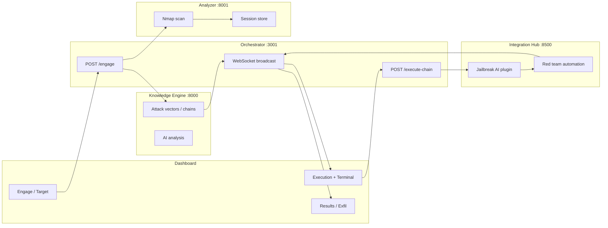

# App-Wide Robustness, Synergy, and Fluid Workflow Plan

## Executive Summary

OpsecAI already has substantial robustness building blocks in Python (`backend/shared/robustness.py`, `fastapi_robustness.py`, `health.py`) and Node (`backend/orchestrator/middleware/robustness.js`). The gap is not missing primitives—it is **inconsistent application**, **fragmented workflow state**, and **contract mismatches** between services and the Next.js dashboard. This plan unifies those pieces into one coherent pipeline: **engage → scan → analyze → chain → execute → exfil → report**, with shared correlation IDs, health gates, and resilient fallbacks at every hop.

---

## Current State

### What exists today

| Layer | Robustness features | Gaps |
|-------|---------------------|------|
| **Knowledge Engine** (Python) | Circuit breakers, retries, `/health`, `/robustness`, `setup_robustness_middleware` | Jailbreak AI path not always behind same breaker pattern |
| **Integration Hub** (Python) | FastAPI robustness middleware | Plugin execution errors not always surfaced to orchestrator with structured codes |
| **OpSec Monitor** (Python) | FastAPI robustness middleware | Chain assess proxy only; no engagement correlation |
| **Orchestrator** (Node) | Custom middleware, circuit breakers, rate limits, engagement persistence, WebSocket + terminal broadcast | Duplicate patterns vs Python `shared/`; not all outbound calls use enhanced axios |
| **Real-time Analyzer** (Go) | In-memory sessions, nmap timeouts | No shared health contract with orchestrator; sessions lost on restart |
| **Frontend** (Next.js) | WebSocket on engagement page, `lib/api.ts`, `lib/websocket.ts`, service monitor | Hardcoded `localhost:3001` / `8000`; `api.ts` points at KE not orchestrator; execute-chain errors opaque |

### Fluid workflow (intended)



### Known breakage: `execute-chain` validation

Terminal error:

```json
{
  "error": "Invalid command chain: Invalid command at index 0: command must be a non-empty string",
  "code": "INVALID_COMMAND_CHAIN"
}
```

**Root cause:** Knowledge Engine attack chains use `steps[].attack.title` + `phase`, not `steps[].command`. Older orchestrator builds rejected steps without `command`. Current source in `index.js` accepts `attack.title` OR `command`, but running container may be stale.

**Fix (Phase 0):**

1. Rebuild orchestrator: `docker compose up -d --build orchestrator`
2. Add `normalizeChainSteps(steps)` before `validateCommandChain` to derive `command` from attack metadata when missing
3. Return structured 400 with `step_index` and `hint` in JSON for UI display

---

## Design Principles

1. **One correlation ID per engagement** — propagated `X-Correlation-ID` / `engagement_id` on every internal HTTP call and WebSocket payload.
2. **Fail soft, report hard** — degraded mode with explicit `degraded_reason`; never silent empty success.
3. **Contract-first steps** — canonical `AttackStep` shape shared by KE, orchestrator, and frontend (OpenAPI or shared JSON schema).
4. **Health before work** — orchestrator `/ready` gates `/engage`; dashboard blocks execute when downstream unhealthy.
5. **Persist workflow checkpoints** — engagement state survives orchestrator restart (extend `engagement-manager`).

---

## Canonical Data Contracts

### AttackStep (unified)

```typescript
interface AttackStep {
  step_id?: string;
  phase: string;                    // MITRE phase label
  command?: string;                 // shell/command to run (optional if derived)
  tool?: string;
  attack: {
    title: string;
    mitre_technique?: string;
    category?: string;
    attack_type?: string;
    detection_method?: string;
    impact?: string;
  };
  rationale?: string;
  executed?: boolean;
  success?: boolean | null;
  output?: string;
  artifacts?: Array<{ type: string; value: unknown }>;
}
```

### Engagement workflow states

| Status | Meaning | Next allowed |
|--------|---------|--------------|
| `starting` | Pipeline boot | `scanning` |
| `scanning` | Analyzer session active | `analysing` |
| `analysing` | KE vectors / overseer | `ready`, `error` |
| `ready` | Chains available | `executing` |
| `executing` | Chain run in progress | `ready`, `error` |
| `error` | Terminal failure | `starting` (retry) |

### Standard error envelope (all services)

```json
{
  "error": "Human-readable message",
  "code": "INVALID_COMMAND_CHAIN",
  "correlation_id": "uuid",
  "details": { "step_index": 0, "field": "command" }
}
```

---

## Phase 0: Quick Wins (1–2 days)

### 0.1 Orchestrator chain normalization

**File:** [backend/orchestrator/index.js](backend/orchestrator/index.js)

- Add `normalizeChainSteps(steps)`:
  - If `!step.command` and `step.attack?.title`, set `command` from template: e.g. `# ${phase}: ${attack.title} (${mitre_technique})`
  - Map `attack.attack_type` → tool hint when present
- Call before `validateCommandChain`
- Align error messages with current validator text

### 0.2 Frontend execute-chain error surfacing

**Files:**

- [frontend/dashboard/app/engagement/[id]/page.tsx](frontend/dashboard/app/engagement/[id]/page.tsx)
- [frontend/dashboard/app/attack-dashboard/page.tsx](frontend/dashboard/app/attack-dashboard/page.tsx)

- Parse `response.json()` on non-OK; show `error`, `code`, `details.step_index`
- Disable Execute button when `orchestrator` health check fails

### 0.3 Environment-based API base URLs

**File:** [frontend/dashboard/.env.example](frontend/dashboard/.env.example) (extend)

```env
NEXT_PUBLIC_ORCHESTRATOR_URL=http://localhost:3001
NEXT_PUBLIC_ANALYZER_URL=http://localhost:8001
NEXT_PUBLIC_KNOWLEDGE_ENGINE_URL=http://localhost:8000
NEXT_PUBLIC_INTEGRATION_HUB_URL=http://localhost:8500
```

Replace hardcoded URLs in engagement and attack-dashboard pages with env vars.

---

## Phase 1: Cross-Service Robustness Synergy (3–5 days)

### 1.1 Shared health aggregation

**Orchestrator** already has `aggregateHealthChecks` in middleware. Extend:

- Poll: KE `/health`, Analyzer `/health` or sessions, Hub `/health`, OpSec `/health`
- Expose `GET /system/health` with per-service latency and `overall_status`
- Dashboard `serviceMonitor.ts` consumes single endpoint

### 1.2 Outbound call hardening (orchestrator)

Ensure all `axios` calls to KE, Analyzer, Hub, OpSec use:

- Enhanced client from `middleware/robustness.js` (timeouts, retries, correlation headers)
- Circuit breaker per dependency (mirror Python `robustness_manager` thresholds)
- Map upstream 502 → `{ code: "UPSTREAM_UNAVAILABLE", service: "knowledge-engine" }`

### 1.3 Python ↔ Node parity

| Python (`shared/robustness.py`) | Node equivalent |
|--------------------------------|-----------------|
| `retry_with_backoff` | axios retry interceptor |
| `CircuitBreaker` | `middleware/robustness.js` CircuitBreaker class |
| `robustness_manager.get_health_report()` | `GET /robustness` on orchestrator aggregating children |

Document mapping in [docs/enhancements/ROBUSTNESS_SYNERGY_PLAN.md](ROBUSTNESS_SYNERGY_PLAN.md) (this file) — no code duplication of logic, but **aligned thresholds** (failure_threshold=3, timeout=30s).

### 1.4 Run synergy tests in CI

**File:** [tests/shared/test_robustness_synergy.py](tests/shared/test_robustness_synergy.py)

- Add orchestrator smoke test (optional): health + engage with mock target
- `npm test` in orchestrator if JS tests added later

---

## Phase 2: Fluid Workflow Engine (5–7 days)

### 2.1 Engagement state machine

**File:** [backend/orchestrator/engagement-manager.js](backend/orchestrator/engagement-manager.js) (or equivalent)

- Persist: `status`, `scan_session`, `attack_chains`, `chain_execution`, `findings`, `log`, `analysis_overseer`
- Valid transitions only (reject illegal `executing` → `scanning`)
- On restart: reload engagements from disk/Postgres

### 2.2 Pipeline checkpoints

In `runEngagementPipeline`:

| Checkpoint | Persisted field | WebSocket event |
|------------|-----------------|-----------------|
| Scan started | `scan_session.id` | `stage: scan_analysis` |
| Scan complete | `scan_session.fingerprint` | `phase_completed` |
| Chains built | `attack_chains` | `stage: vector_decomposition` |
| Quality gate | `analysis_overseer.quality` | `stage: quality_gate` |
| Execution start | `chain_execution` | `status: executing` |
| Execution end | `chain_execution.result` | `status: ready` |

### 2.3 Integration Hub bridge for execution

**Flow:** `execute-chain` → Hub plugin `redteam_automation` OR dedicated `execute_step` operation

- Avoid duplicating jailbreak logic only in orchestrator
- Single execution path with OpSec assess per step
- Return artifacts suitable for ExfilPanel (`findings`, `captured_data`)

### 2.4 Analyzer session linking

- Store `eng.scan_session.analyzer_id` when scan starts
- Poll `GET /sessions/:id` until `ready` instead of blind timeout
- Configurable `scan_timeout_sec` from engagement `boundary_profile`

---

## Phase 3: UI Workflow Cohesion (5–7 days)

Align with existing Next.js app structure under [frontend/dashboard/app/](frontend/dashboard/app/).

### 3.1 Unified operations hub

**Route:** `/engagement/[id]` (enhance existing page)

| Tab / Section | Component | Data source |
|---------------|-----------|-------------|
| Overview | Status + aggression + target | `GET /engagements/:id` |
| Execution | ExecutionPanel | WebSocket + `chain_execution` |
| Attack chain | PhaseVisualizer | `attack_chains.chains[]` |
| Scan | Scan results | `scan_session` + Analyzer sessions |
| Exfil / Results | ExfilPanel | `findings`, execution artifacts |
| Terminal | Live log | WebSocket `broadcastTerminal` |

### 3.2 Shared client library

**Extend:** [frontend/dashboard/lib/api.ts](frontend/dashboard/lib/api.ts)

```typescript
export const orchestrator = {
  engage(target, aggression) { ... },
  getEngagement(id) { ... },
  executeChain(engagementId, chainIndex, chain) { ... },
  systemHealth() { ... },
};
```

### 3.3 WebSocket message types (versioned)

```typescript
type WSMessage =
  | { type: 'engagement_update'; payload: Engagement }
  | { type: 'terminal'; line: string; level: 'info'|'success'|'error'|'warning' }
  | { type: 'step_result'; step: number; result: StepResult }
  | { type: 'health'; services: ServiceHealth[] };
```

Frontend switches on `type` instead of guessing shape from `data.id`.

### 3.4 Service health strip (global)

Use [frontend/dashboard/lib/serviceMonitor.ts](frontend/dashboard/lib/serviceMonitor.ts):

- Poll orchestrator `GET /system/health` every 30s
- Show red banner when Orchestrator down (fixes "Load failed" on port 3001)

---

## Phase 4: Observability and Operations (2–3 days)

### 4.1 Structured logs everywhere

- Orchestrator: already JSON logs — add `engagement_id`, `chain_index` on execute path
- Python: ensure `correlation_id` in uvicorn access logs via middleware

### 4.2 Metrics

- Orchestrator `/metrics`: request count, execute-chain duration, WS connections
- Dashboard: optional dev panel showing last correlation ID

### 4.3 Start scripts synergy

**Files:** [start-all.sh](start-all.sh), [status.sh](status.sh), [start.sh](start.sh)

- `status.sh` checks all ports: 3000, 3001, 8000, 8001, 8002, 8500, 5432, 6333
- Wait-for-healthy loop before declaring "ready"
- Print engagement test curl with valid chain payload

---

## Testing Strategy

### Unit

- `normalizeChainSteps` — attack-only steps pass validation
- Engagement state machine — illegal transitions rejected

### Integration

1. `POST /engage` → wait `ready` → `GET /engagements/:id` has `attack_chains`
2. `POST /execute-chain` with KE-shaped chain → 200 or structured 4xx
3. WebSocket receives `executing` then terminal lines

### E2E (manual)

```bash
# After services up
curl -s http://localhost:3001/health | jq .
curl -s -X POST http://localhost:3001/engage \
  -H "Content-Type: application/json" \
  -d '{"target":"127.0.0.1","aggression_level":5}' | jq .

# Use engagement_id from response
curl -s -X POST http://localhost:3001/execute-chain \
  -H "Content-Type: application/json" \
  -d '{
    "engagement_id": "<id>",
    "chain_index": 0,
    "chain": {
      "steps": [{
        "phase": "Reconnaissance",
        "attack": {
          "title": "Web Application Scanning",
          "mitre_technique": "T1190",
          "detection_method": "WAF logs"
        }
      }]
    }
  }' | jq .
```

---

## Implementation Priority

| Priority | Item | Impact |
|----------|------|--------|
| P0 | Rebuild orchestrator + chain normalization | Fixes execute-chain 400 |
| P0 | Env-based API URLs + health strip in UI | Fixes "Orchestrator Down / Load failed" |
| P1 | `GET /system/health` aggregation | Single pane for all services |
| P1 | WebSocket typed messages | Stable live execution UI |
| P2 | Engagement persistence + state machine | Survives restarts |
| P2 | Hub-unified execution path | One execution brain |
| P3 | OpenAPI / shared schema for AttackStep | Long-term contract safety |
| P3 | CI synergy tests | Regression prevention |

---

## Success Criteria

- [ ] `execute-chain` accepts Knowledge Engine chain shape without manual `command` field
- [ ] Dashboard shows orchestrator/analyzer/KE health from one call
- [ ] Engagement survives orchestrator restart with status intact
- [ ] User can follow full workflow in one engagement page: scan → chains → execute → exfil
- [ ] All cross-service errors include `code` + `correlation_id`
- [ ] `tests/shared/test_robustness_synergy.py` passes in CI

---

## Files to Touch (summary)

| Area | Primary files |
|------|----------------|
| Orchestrator | `backend/orchestrator/index.js`, `middleware/robustness.js`, `engagement-manager.js` |
| Integration Hub | `backend/integrations/main.py`, `integrations/jailbreak_ai/plugin.py` |
| Shared Python | `backend/shared/robustness.py`, `fastapi_robustness.py`, `health.py` |
| Frontend | `frontend/dashboard/app/engagement/[id]/page.tsx`, `lib/api.ts`, `lib/serviceMonitor.ts` |
| Ops | `start-all.sh`, `status.sh`, `docker-compose.yml` |
| Tests | `tests/shared/test_robustness_synergy.py` |

---

## Relation to Other Plans

- **Frontend UI plan** (ExecutionPanel, PhaseVisualizer, ExfilPanel): Implement as Phase 3 sections inside existing `/engagement/[id]` rather than a separate CRA stack under `src/components/`.
- **Dashboard implementation summary** ([docs/enhancements/DASHBOARD_IMPLEMENTATION_SUMMARY.md](DASHBOARD_IMPLEMENTATION_SUMMARY.md)): Reuse WebSocket utility; extend message types per Phase 3.3.

This plan does not modify the separate frontend components plan file; it subsumes that UI work into the engagement-centric fluid workflow.
